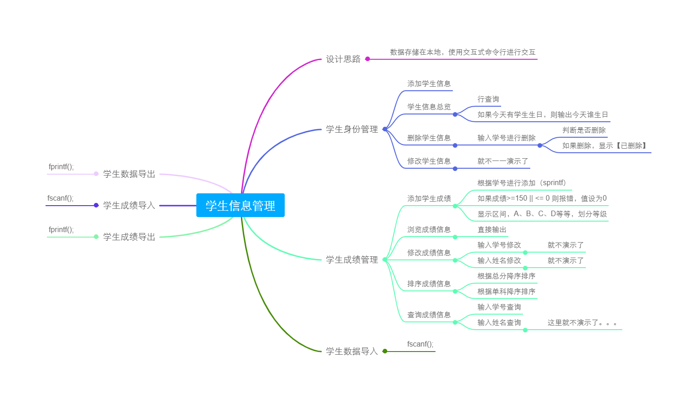
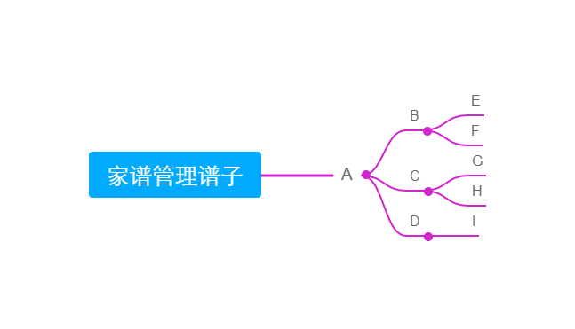
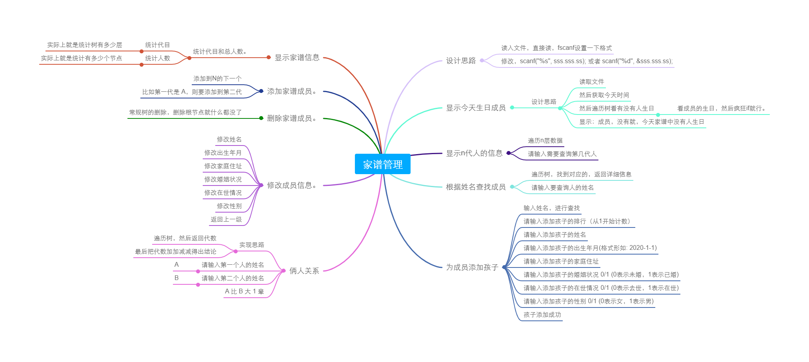
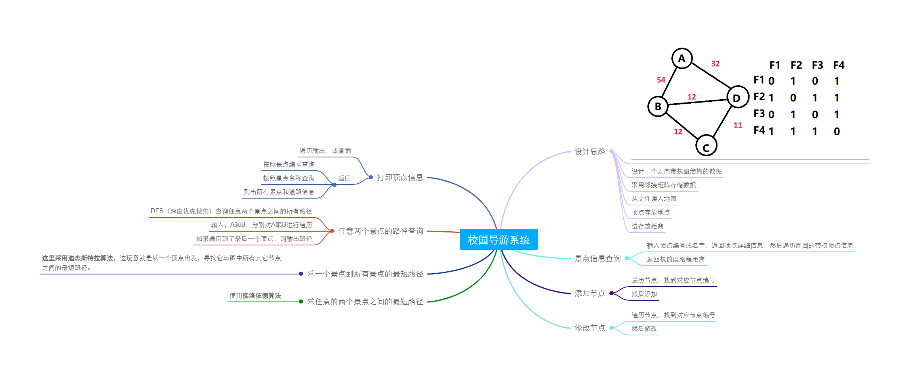

## WriteCode-In-The-School-ICU
> 😅在学校瞎鸡巴写的东西

记录一下在学校写过的操蛋代码😅，该README比较暴力，请酌情阅读他妈的😅。

朋友是一个他妈的开除学籍警告😅.jpg

### 大一
> 小学期

小学期一共四个他妈的项目，原本是个人做的，后来老师受全班央求之下变成团队了😅

这他妈的小学期跟我好几个项目重了，我操你*😅，实在是他妈的忙不过来啊，我操。😅

还好在最后5天内全写出来了，我操。虽然我只负责了三个项目，但这分还是他妈的低啊，我操，早知道四个全写了😅

具体哪四个项目呢😅，很传统，我这里就不过多介绍了，自己看代码去吧😅

1. 学生信息管理（很jb弱智，妈的，不说了自己看吧）
2. 家谱设计（很傻逼😅）
3. ~~停车场~~（这玩意不是我写的，但大致逻辑就是2个队列放停车场，1个栈放车车，然后对着这俩玩意进行操作就可以了，血亏，如果这题我写下的话，估计分数就95+了😭）
4. 校园导航系统（傻逼😅）

然后，下面有几张他妈的~~思维导图~~😅

我绝对~~没有逆向~~老师给的程序，~~真的~~









> 校内渗透测试脚本

在校内，接到了老师派下来的渗透测试任务😋，写了几个脚本跑学校资产，这里就不放了，自己脑补吧😋。

> CMCTF-4、CMCTF-5

跟学长们组织的AWD比赛，Easy Check脚本，没啥技术点就不单独建文件了。

```python
# -*- coding:utf8 -*-
import sys
import re
from requests import *

def check1(url):
     try:
          r = get(ip)
          if(r.status_code == 200):
               print("[*] Web Check1 Successful!")
          else:
               return False
     except Exception as e:
          print("[!] Web Check1 Error!")
     return True

# MAIN
if __name__ == '__main__':
    ip=sys.argv[1]
    port=int(sys.argv[2])
    print(checker(ip,port))
```

### 大二

### 大三

### 大四（？）

### 杂七杂八